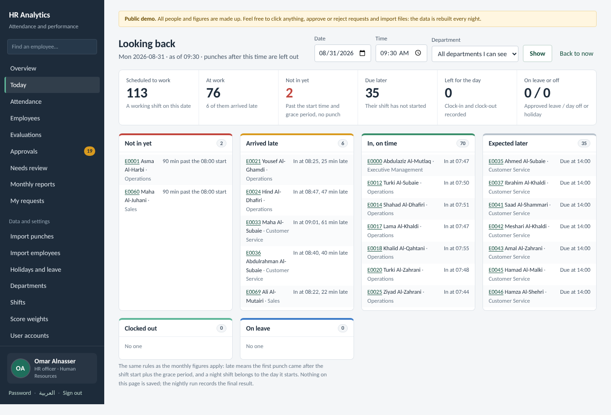
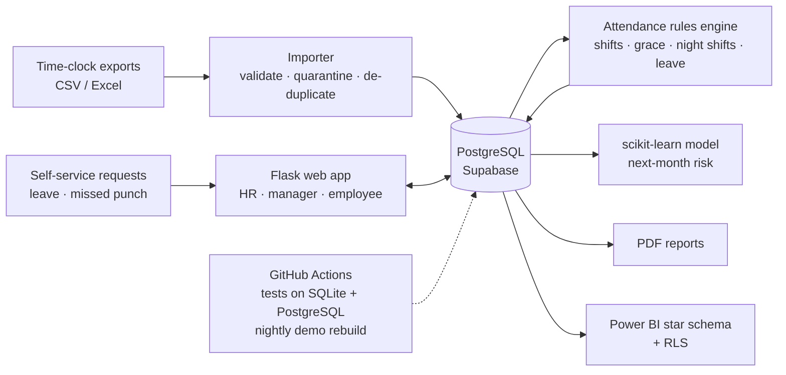
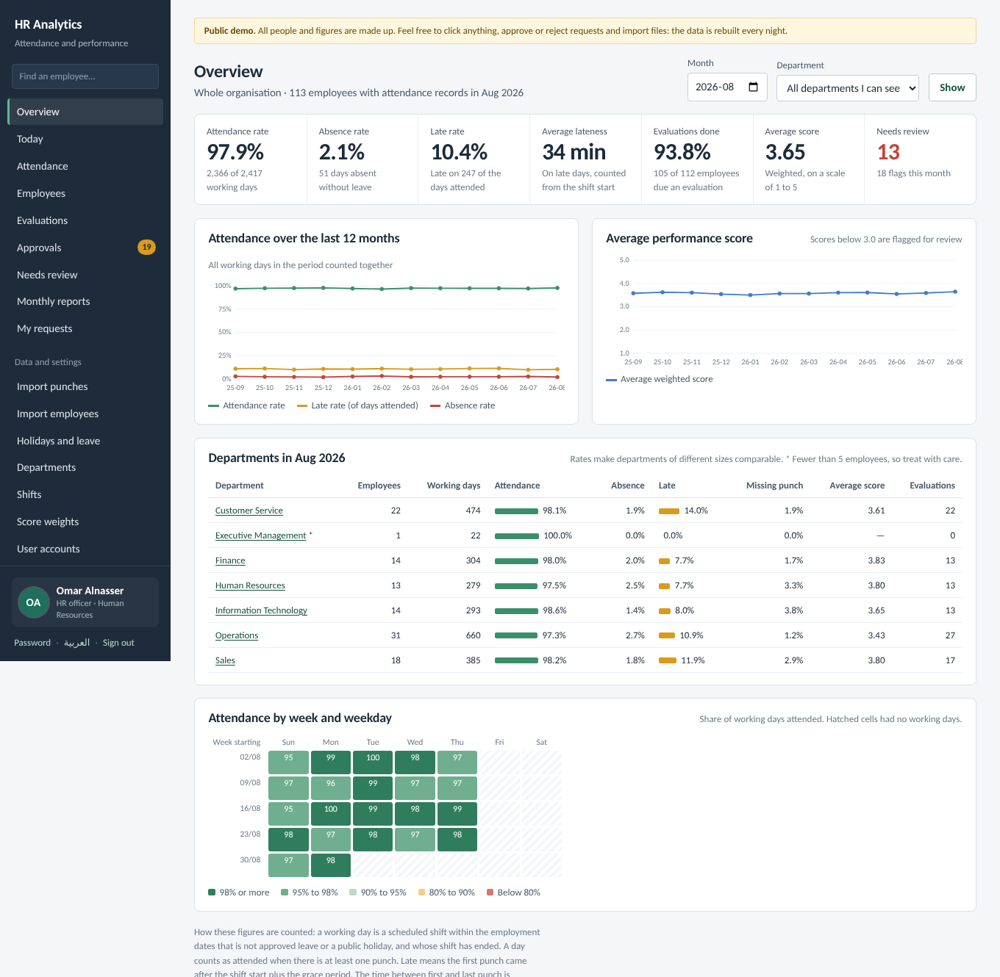
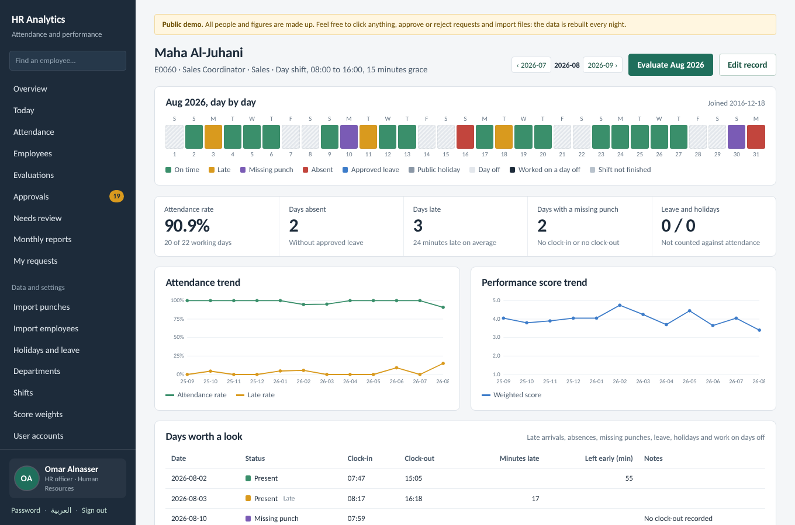
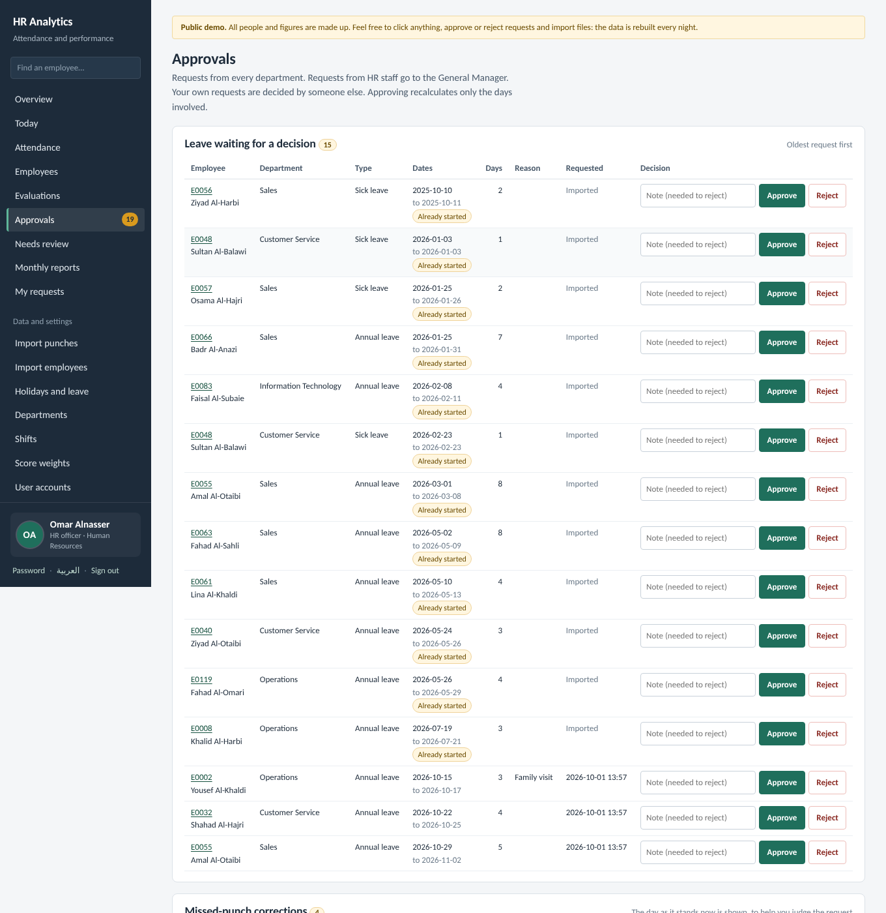
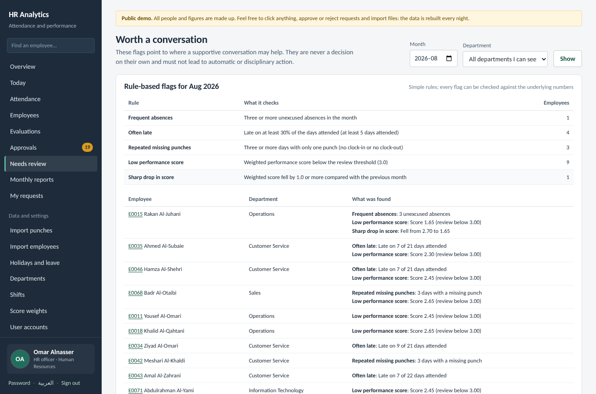
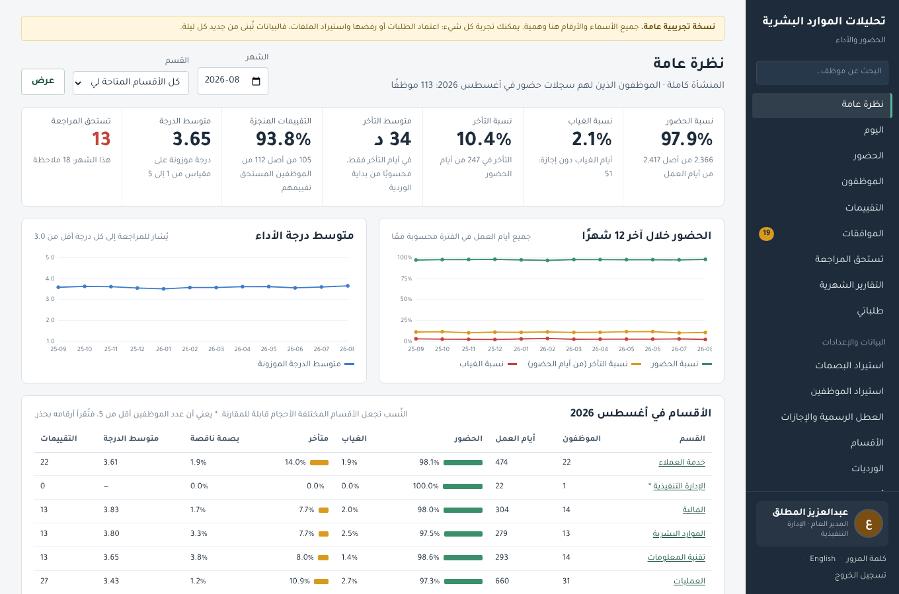
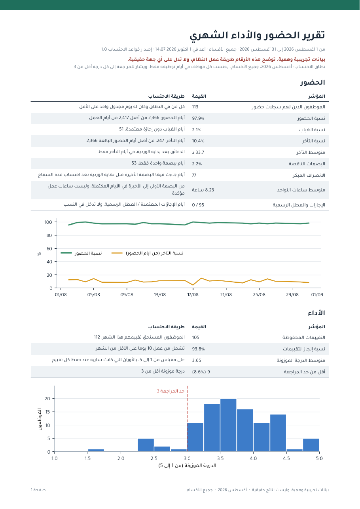

# HR Attendance & Performance Analytics

**Turns raw time-clock punches and monthly evaluations into trustworthy HR metrics, with a live web app in English and Arabic, PostgreSQL, PDF reports in both languages, an ML early-warning model and a Power BI kit.**

[](https://github.com/OmarAlnasser/hr-attendance-analytics/actions/workflows/tests.yml)
&nbsp;**[▶ Live demo](https://hr-attendance-analytics.onrender.com)**, no sign-up: pick *General Manager*, *HR officer*, *Department manager* or *Employee* on the login page, in English or **العربية**.

> The demo runs on a free plan: the first visit after a quiet period takes about a minute to wake up. All data is synthetic (121 invented employees, 12 months) and is rebuilt every night, so click anything.



---

## What it does

| For | Feature |
|---|---|
| **HR** | Organisation dashboard: attendance, absence and late rates, each shown with its numerator and denominator · department benchmarking · weekday × week heatmap · 12-month trends |
| | **Today board**: who is in, late, not in yet or on leave right now. You can also replay any past moment ("what did 09:30 last Tuesday look like?") |
| | Import device exports (CSV/Excel). Every bad row is quarantined with a reason, and the same file or punch is never stored twice |
| | User accounts, bulk employee onboarding from CSV, holidays, shifts, score weights, full audit log |
| | Monthly PDF report (on demand or scheduled), Power BI star-schema export with row-level security |
| **General Manager** | Everything HR sees, plus the decisions HR should not take about itself: approving HR staff's leave and corrections, evaluating HR staff, giving or removing HR access, managing HR accounts. Their own requests are recorded as approved, because nobody sits above them |
| **Managers** | Their department only (enforced on the server, in every query): approvals inbox for leave and missed-punch corrections, monthly evaluations, "needs review" flags |
| **Employees** | Their own month day by day, leave requests, "I forgot to punch" corrections that count only once approved |
| **Everyone** | English or Arabic with one click. The Arabic is written as Arabic (not machine-translated), pages switch to right-to-left, and the sidebar shows the signed-in person's name, role and initials |

**Human-in-the-loop by design.** Transparent rules flag cases first. A logistic-regression model scores next-month risk as a second signal (F1 0.48 vs 0.43 for a rules baseline, time-based split). The flags are for a conversation, never an automatic decision. The [model card](docs/experimental_model.md) covers target leakage, the split and limitations.

## Try it in 60 seconds

1. Open the **[live demo](https://hr-attendance-analytics.onrender.com)** and choose **HR officer** (Omar Alnasser).
2. **Today** → press *Replay* in the yellow note to see a real working morning.
3. **Approvals** → approve a missed-punch correction, then open that employee: the day turns from *single punch* to *present*. Only that one day is recalculated.
4. Sign out, choose **Department manager**: the same pages now show only one department, and other departments return *403 Not permitted*.
5. Press **العربية** at the foot of the sidebar: every page, message and the monthly PDF switch to Arabic, laid out right to left.

## Architecture



| Layer | Technology |
|---|---|
| Web | Python 3.11, Flask, Jinja, server-rendered HTML with **no JavaScript** (strict CSP), inline SVG charts, English and Arabic (RTL) |
| Data | **PostgreSQL** in production (Supabase), SQLite for local use. The same SQL runs on both, with a thin adapter (`hr_analytics/db/connection.py`) |
| Processing | pandas, deterministic rules engine, idempotent re-processing |
| ML | scikit-learn logistic regression with a time-based split and a rules baseline |
| Reporting | ReportLab + matplotlib (PDF in English or Arabic; Arabic shaped with arabic-reshaper + python-bidi and the Tajawal font), Power BI (Power Query M, DAX measures, RLS roles) |
| Hosting | Render (gunicorn), Supabase PostgreSQL, GitHub Actions (CI + nightly demo rebuild) |

## Engineering highlights

- **Correct denominators.** The late rate is computed over *attended* days and the absence rate over *expected* days. Holidays, approved leave and pending shifts are excluded, and every figure on screen shows its basis. [Metric definitions](docs/metrics_definitions.md).
- **Security.** Authorisation is enforced in SQL for every query, not by hiding menus. The app has CSRF protection, a login throttle, scrypt password hashes, forced change of temporary passwords, a full audit trail, and spreadsheet formula-injection protection on exports.
- **Data quality.** Two-level de-duplication (file hash + unique punch), time-zone normalisation, rejected rows kept with their original values, and re-processing that gives identical results when repeated.
- **Plain language, two languages.** Every status, rule and import problem is stored as a short code but always shown as a sentence ("No clock-out recorded", not `missing_out_punch`). A test fails if any sentence lacks its Arabic version or if a code reaches a page.
- **Tested on two databases.** 130 automated tests run on SQLite and on PostgreSQL in CI. They cover edge cases such as 08:15:59 counting as on time, night shifts crossing midnight, hires in the middle of a month, permission probing, the General Manager's powers, and every page rendering in Arabic.

## Screenshots

| | |
|---|---|
|  |  |
| HR overview | One employee's month, day by day |
|  |  |
| Approvals inbox | Rule flags + experimental model |
|  |  |
| The same overview in Arabic, as the General Manager | The monthly PDF report in Arabic |

## Run it locally

```bash
git clone https://github.com/OmarAlnasser/hr-attendance-analytics.git
cd hr-attendance-analytics
python -m venv .venv && source .venv/bin/activate      # Windows: .venv\Scripts\activate
pip install -r requirements.txt
cp .env.example .env                                     # then set HR_SECRET_KEY (see the file)
python -m hr_analytics demo                              # builds a SQLite demo database (~30 s)
python -m hr_analytics.web                               # http://127.0.0.1:5000
```

To use PostgreSQL instead, set `HR_DATABASE_URL=postgresql://...` before `demo`. Tests: `python -m unittest discover -s tests -t .`. Add `HR_TEST_DATABASE_URL=postgresql://...` to run them on PostgreSQL.

## Documentation

- [Deployment (Render + Supabase + GitHub Actions)](docs/deployment.md)
- [Metric definitions](docs/metrics_definitions.md) · [Assumptions & limits](docs/assumptions.md) · [Model card](docs/experimental_model.md) · [What was verified](docs/verification.md) · [Power BI build guide](powerbi/README.md) · [Changelog](CHANGELOG.md)
- **Arabic documentation:** [README.ar.md](README.ar.md). The detailed docs in `docs/` are in Arabic.

---

Built by **Omar Hamad Al-Nasser**, Business Administration (MIS) student at Imam Abdulrahman Bin Faisal University. The project focuses on business intelligence and data analytics. All data in this repository and in the demo is synthetic.
